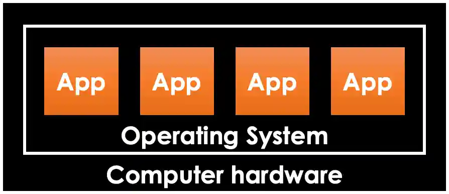
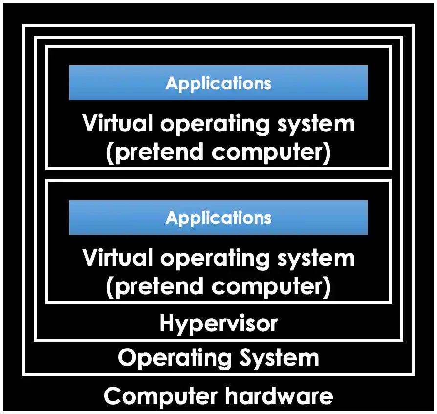
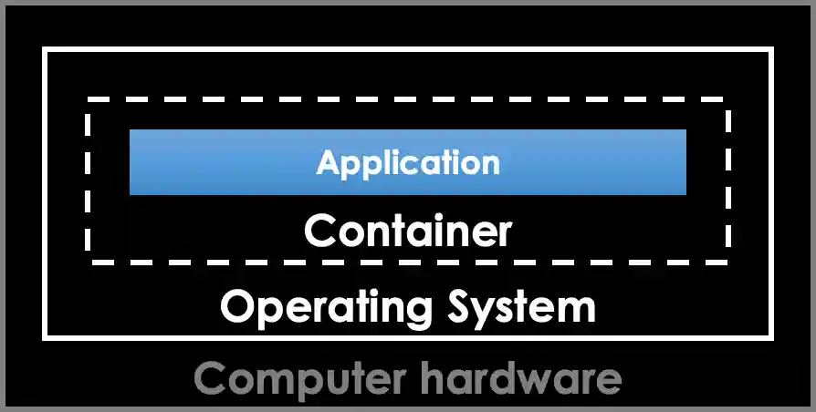
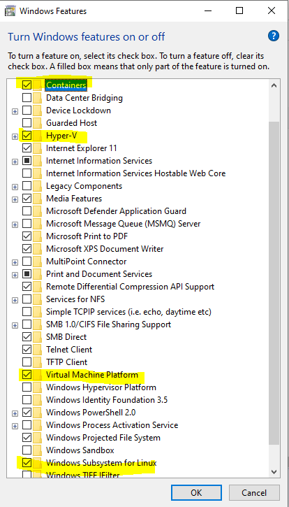
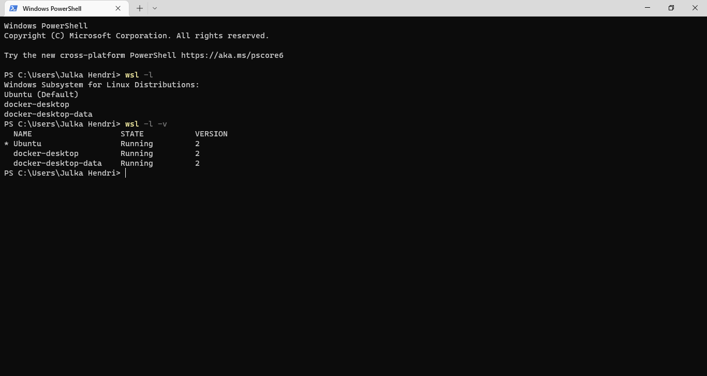

# Container-Based Application

# Table of Contents
1. [Introduction](#introduction)
2. [Setup Environment](#setup-environment)
3. [Container App](#container-app)
4. [Container Orchestration](#container-orchestration)
5. [Hub](#hub)

## Introduction

### Begining
1. Simple

2. Virtualization

3. Container

### Container Engine
1. Linux Container
2. Windows Container

## Setup Environment (Windows)
1. [https://docs.docker.com/desktop/install/windows-install/](https://docs.docker.com/desktop/install/windows-install/)
2. Prerequisite

   
3. Windows Subsystem for Linux (WSL) 

   [https://learn.microsoft.com/en-us/windows/wsl/install-manual](https://learn.microsoft.com/en-us/windows/wsl/install-manual)
   
4. Visual Studio 2022 | VS 2019 - 16.4

## Container-Based Application
### Interaction
1. Terminal
2. Log

### Supported App Type
1. Web App
2. Service (Open Port)
3. Console App

### Feature
1. Logging
2. Installation/Configuration Wizard (optional)
3. Path Resolver (Linux vs Windows)

### DockerFile
1. Create an Image
 
## Container Orchestration

### Docker-Compose
1. Source 
	1.1 Build from DockerFile
	1.2 Parameterize Image
2. Mount Volume
3. Custom EntryPoint

## Hub
### Local Docker Registry
docker run -d -p 11000:5000 --restart=always --name registry.local -v D:/Docker/Registry:/var/lib/registry registry:2

# Conclution